# INFORME FORENSE PERICIAL

**Título del caso / Referencia:** Incident on Linux Server I  
**Perito/s:** Manuel Maye Piulestan, José Luis Godoy Khattaoui, Hugo Flores Molina, Juan Pérez Ortega  
**Fecha:** 21 de abril de 2026  
**N.º Expediente:** 0000-0002    

---

## Índice

1. [Juramento & Declaración de Abstención y Tacha](#1-juramento--declaración-de-abstención-y-tacha)
2. [Palabras Clave](#2-palabras-clave)
3. [Índice de Figuras](#3-índice-de-figuras)
4. [Resumen Ejecutivo](#4-resumen-ejecutivo)
5. [Introducción](#5-introducción)
6. [Fuentes de Información](#6-fuentes-de-información)
7. [Análisis](#7-análisis)
8. [Limitaciones](#8-limitaciones)
9. [Conclusiones](#9-conclusiones)
10. [Anexo 1 - Sobre los Peritos](#10-anexo-1---sobre-los-peritos)
11. [Anexo 2 - Indicadores de Compromiso (IOCs)](#11-anexo-2---indicadores-de-compromiso-iocs)
12. [Anexo 3 - Sumas de Verificación y Validación](#12-anexo-3---sumas-de-verificación-y-validación)

---

## 1. Juramento & Declaración de Abstención y Tacha

Los peritos abajo firmantes, designados por la parte empresarial interesada en el presente procedimiento, manifiestan su compromiso de cumplir fielmente el encargo recibido, actuando con la máxima objetividad, rigor técnico y respeto a la verdad, conforme a los principios de veracidad, imparcialidad y confidencialidad exigidos por la Ley 1/2000, de 7 de enero, de Enjuiciamiento Civil, y demás normativa aplicable. Nos comprometemos a exponer únicamente los hechos y conclusiones que resulten de las pruebas y evidencias analizadas, sin omitir ni alterar información relevante, y a mantener la debida reserva respecto de los datos a los que hemos tenido acceso en el ejercicio de nuestra función.

**Declaración de abstención:**

De acuerdo con lo dispuesto en los artículos 124 y 125 de la Ley de Enjuiciamiento Civil, los peritos firmantes manifiestan expresamente que no concurre en su persona causa alguna de abstención que les impida ejercer el cargo conferido por la empresa. Declaran no tener interés personal, directo o indirecto, en el objeto del litigio, ni mantener relación de parentesco, amistad, enemistad, dependencia profesional o cualquier otra circunstancia que pudiera afectar a su imparcialidad, garantizando así la plena objetividad en el desempeño de su labor pericial.

**Declaración de tacha:**

Asimismo, conforme a lo previsto en los artículos 343 y siguientes de la Ley de Enjuiciamiento Civil, los peritos abajo firmantes hacen constar que no concurre en su persona causa de tacha que pueda afectar a su idoneidad o imparcialidad. Declaran no haber sido condenados por delito de falso testimonio, ni estar incursos en causa de incapacidad, incompatibilidad o prohibición legal alguna para el ejercicio de la función pericial, asegurando el cumplimiento íntegro de los requisitos legales y éticos exigidos para el desempeño de su cometido como peritos de parte.

En Cádiz, 21 de abril de 2026

---

## 2. Palabras Clave

- **Compromiso del servidor**: Acceso no autorizado a un servidor, demostrando que el sistema ha sido penetrado y controlado por atacantes externos.
- **Explotación de vulnerabilidades**: Aprovechamiento de fallos de seguridad en software (en este caso, el plugin reflex-gallery) para ganar acceso no autorizado.
- **Webshells PHP**: Archivos maliciosos que actúan como puertas traseras, permitiendo ejecutar comandos en el servidor a través de internet.
- **Persistencia**: Métodos que utiliza el atacante para mantener acceso continuo al servidor, incluso después de reiniciar.
- **RCE (Ejecución de Código Remoto)**: Capacidad de ejecutar comandos arbitrarios en un servidor desde una ubicación remota sin autorización.
- **Botnet**: Red de dispositivos comprometidos controlados por atacantes de forma centralizada para realizar ataques coordinados.
- **Inteligencia de amenazas**: Recopilación y análisis de información sobre direcciones IP maliciosas y patrones de ataque para identificar actores de amenazas.
- **Volcado de memoria RAM**: Copia de toda la memoria activa del sistema en el momento del incidente, permitiendo detectar procesos y conexiones en tiempo real.
- **Exfiltración de datos**: Robo no autorizado de información sensible del servidor hacia servidores externos controlados por atacantes.

---

## 3. Índice de Figuras

| N.º | Descripción | Página |
|-----|-------------|--------|
| Figura 1 | Apache access.log con intento RCE | 8 |
| Figura 2 | Continuación de access.log | 8 |
| Figura 3 | Peticiones anómalas en access.log | 9 |
| Figura 4 | Metadatos del access.log | 9 |
| Figura 5 | Error.log de Apache | 10 |
| Figura 6 | Bash history - Instalación inicial | 11 |
| Figura 7 | Bash history - Despliegue de WordPress | 11 |
| Figura 8 | Bash history - Reinicios y cambios | 12 |
| Figura 9 | Metadatos del bash-history | 12 |
| Figura 10 | Historial MySQL | 13 |
| Figura 11 | Webshells borradas | 14 |
| Figura 12 | Archivos borrados en /var/www | 14 |
| Figura 13 | Archivos borrados en configuración Apache | 15 |
| Figura 14 | Archivos borrados en uploads de WordPress | 15 |
| Figura 15 | Banner de Volatility - Información del sistema | 16 |
| Figura 16 | Conexión SSH sospechosa 1 | 17 |
| Figura 17 | Conexión SSH sospechosa 2 | 17 |
| Figura 18 | Historial de comandos en RAM | 18 |
| Figura 19 | Yarascan en proceso SSH | 18 |
| Figura 20 | Yarascan en proceso Apache | 19 |
| Figura 21 | Detección de posible malware | 19 |
| Figura 22 | VirusTotal - IP 185.172.164.41 | 20 |
| Figura 23 | VirusTotal - IP 199.195.254.118 | 20 |
| Figura 24 | VirusTotal - IP 5.188.210.7 | 21 |
| Figura 25 | VirusTotal - IP 88.0.112.115 | 21 |
| Figura 26 | VirusTotal - IP 94.242.54.22 | 21 |

---

## 4. Resumen Ejecutivo

Se confirmó el compromiso del servidor web que aloja `ganga.site` tras un análisis forense integral de disco y memoria RAM. Los análisis realizados revelan que atacantes externos lograron acceso no autorizado al sistema mediante la explotación de vulnerabilidades en componentes del servidor, instalaron software malicioso para mantener acceso permanente y ejecutaron comandos administrativos en el servidor.

**Hallazgos Principales:**

1. **Vector de entrada**: Explotación de vulnerabilidades en el plugin WordPress reflex-gallery, que permitió la subida de archivos maliciosos sin validación adecuada.

2. **Métodos de acceso**: El atacante instaló múltiples webshells PHP y obtuvo acceso SSH directo, estableciendo múltiples vectores de persistencia.

3. **Actividades maliciosas**: Se ejecutaron comandos remotos para descargar herramientas atacantes desde servidores externos, se modificó la base de datos MySQL y se alteraron archivos de configuración del sistema.

4. **Inteligencia de amenazas**: Las direcciones IP origen de los ataques fueron verificadas como maliciosas mediante VirusTotal, confirmando actividad previamente atribuida a botnets conocidas.

**Recomendaciones Inmediatas:**

- Aislamiento completo del servidor de la infraestructura
- Restauración desde backup previo al incidente
- Cambio de todas las credenciales administrativas
- Auditoría forense de logs para identificar datos comprometidos
- Implementación de parches de seguridad en todo el stack tecnológico

Este informe documenta los análisis técnicos realizados, las evidencias encontradas y las conclusiones derivadas del examen pericial de las imágenes forenses adquiridas.

---

## 5. Introducción

### 5.1 Antecedentes

El servidor comprometido ejecutaba una plataforma web basada en WordPress 4.8.1 con Apache como servidor HTTP, MySQL como gestor de base de datos y PHP como lenguaje de programación del lado del servidor. La infraestructura de base de datos se encontraba alojada en Amazon AWS RDS.

El servidor fue objeto de acceso no autorizado por atacantes externos, quienes aprovecharon vulnerabilidades en los componentes del servidor para obtener ejecución de código remota. Durante el incidente, se detectaron intentos de exfiltración de datos y de transformación del servidor en máquina comprometida para fines maliciosos.

### 5.2 Objetivos

El presente análisis forense persigue los siguientes objetivos:

- Confirmar la ocurrencia del incidente de seguridad y documentar los hechos técnicos
- Identificar el vector de entrada utilizado por los atacantes
- Reconstruir la línea de tiempo del incidente
- Localizar y analizar evidencias de actividad maliciosa
- Determinar el alcance del compromiso y la naturaleza de las actividades ejecutadas
- Identificar indicadores de compromiso (IOCs) para futuras detecciones
- Formular recomendaciones de remediación y mejora de seguridad

---

## 6. Fuentes de Información

Las fuentes de información analizadas incluyen:

- EVD-001: Imagen forense de disco duro del servidor Linux comprometido
- EVD-002: Volcado de memoria RAM (dump) adquirido del servidor en el momento de la incidencia

### 6.1 Adquisición de Evidencias

| Campo | Valor |
|-------|-------|
| ID Evidencia | EVD-001 |
| Tipo de Dispositivo | Imagen de Disco |
| Sistema Operativo | Ubuntu 16.04 LTS |
| Kernel | 4.4.0-1061-aws |
| Herramienta de Adquisición | Autopsy v4.22.1 |
| Fecha de Adquisición | 20 de abril de 2026 |
| SHA-1 Original | 5b0a9cc8ff4ebd5aa3e1e36d8713e3b24b072e79 |
| SHA-256 Imagen Forense | 5b0a9cc8ff4ebd5aa3e1e36d8713e3b24b072e79 |

| Campo | Valor |
|-------|-------|
| ID Evidencia | EVD-002 |
| Tipo de Dispositivo | Memoria RAM (8GB) |
| Herramienta de Adquisición | Volatility Framework v2.6 |
| Fecha de Adquisición | 20 de abril de 2026 |
| SHA-256 Volcado | bc2ebb435e75b3406280a2967b1c2696fc3e160a |

**Cadena de Custodia**

| # | Entrega (Nombre/Firma) | Recibe (Nombre/Firma) | Fecha | Propósito | Método |
|---|------------------------|-----------------------|-------|-----------|--------|
| 1 | [Empresa afectada] | Peritos análisis | 20/04/2026 | Adquisición forense | FTK Imager |
| 2 | Hugo Flores | Imagen Memoria RAM | 21/04/2026 | Almacenamiento seguro | Contenedor cifrado |
| 2 | Hugo Flores | Imagen Disco | 21/04/2026 | Almacenamiento seguro | Contenedor cifrado |
---

## 7. Análisis

### 7.1 Herramientas Utilizadas

| Herramienta | Versión | Propósito |
|-------------|---------|-----------|
| Autopsy | 4.14.0 | Análisis de sistema de archivos y búsqueda de evidencias |
| Volatility Framework | 2.6 | Análisis de volcado de memoria RAM |
| VirusTotal | API v3 | Verificación de reputación de direcciones IP y hashes |

### 7.2 Procesos de Análisis

El análisis se estructuró en dos fases principales: análisis de disco duro e análisis de memoria RAM.

#### 7.2.1 Análisis de Disco: Logs del Servidor Web

**Objetivo:** Identificar intentos de acceso remoto no autorizado y actividad maliciosa registrada en los logs de Apache.

**Procedimiento:**

Se examinaron los archivos de log del servidor Apache (access.log y error.log) utilizando Autopsy. Se buscaron patrones de ataques conocidos, intentos de ejecución de código remota y acceso a rutas sensibles.

**Hallazgos:**

Los logs de Apache revelan múltiples intentos de explotación:

1. **Intento de RCE vía /login.cgi**: Se identificó una petición GET que intenta ejecutar el comando `wget` para descargar un binario desde http://104.244.72.82/, consistente con ataques de botnet Mirai.

2. **Escaneo de vulnerabilidades**: Se detectaron múltiples peticiones de herramientas de escaneo automático (zgrab, python-requests) probando el servidor en busca de servicios vulnerables.

3. **Intentos de acceso a componentes sensibles**: Solicitudes a XDEBUG_SESSION_START y otras rutas indicativas de intentos de activación de debuggers remotos.

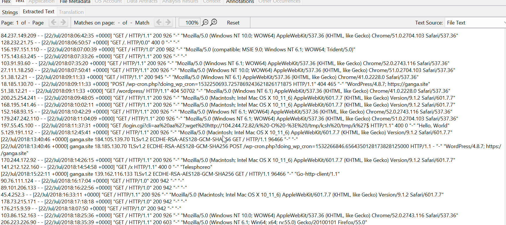

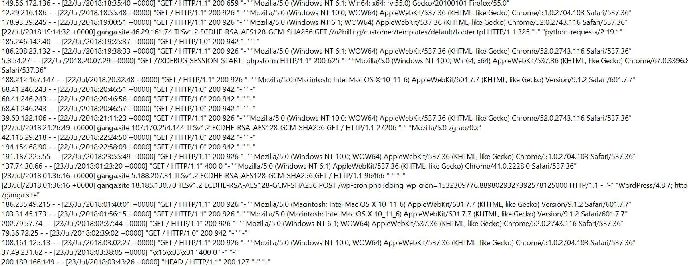

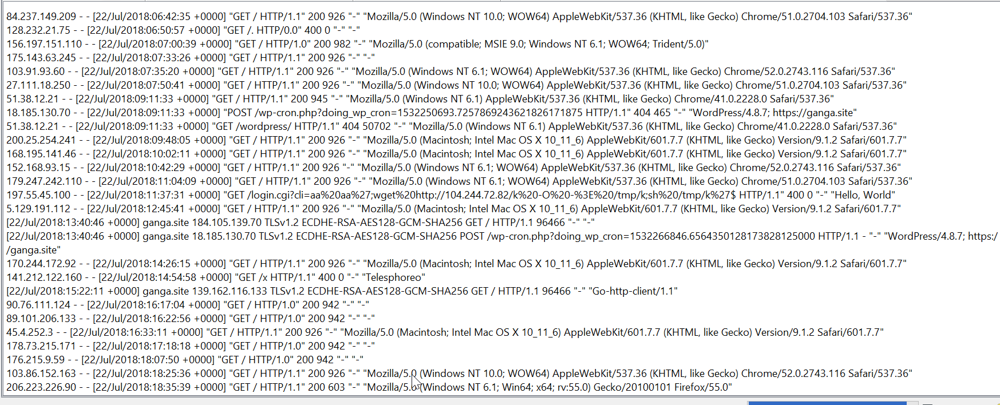

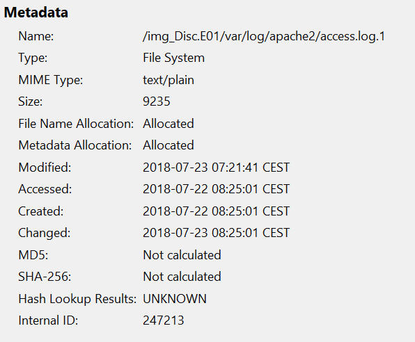

El análisis de error.log revela:

- Múltiples reinicios del servicio Apache (indicativo de inestabilidad o intentos de explotación)
- Error en wp-config.php de WordPress (intento de acceso a configuración sensible)

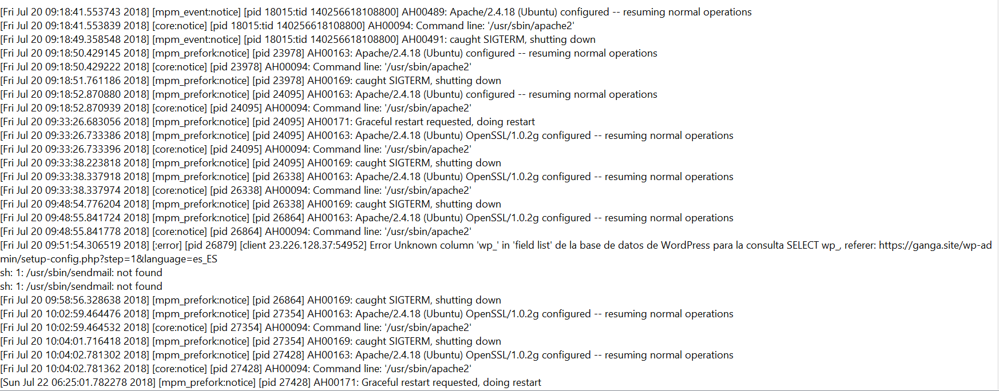

#### 7.2.2 Análisis de Disco: Historial de Comandos del Sistema

**Objetivo:** Reconstruir las actividades ejecutadas en el servidor durante y después del compromiso.

**Procedimiento:**

Se examinó el archivo .bash_history del usuario ubuntu utilizando Autopsy para identificar comandos ejecutados legítimos e indicios de manipulación.

**Hallazgos:**

**Fase 1 - Instalación Inicial (legítima):**
- Instalación de Apache, PHP, MySQL y certificados SSL (Let's Encrypt)
- Configuración estándar de servidor web

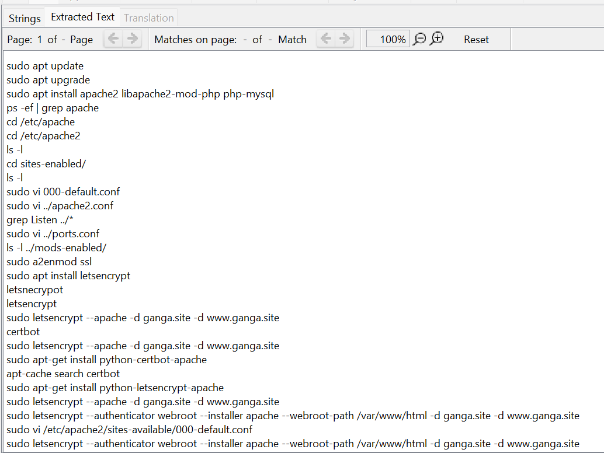

**Fase 2 - Despliegue de WordPress:**
- Conexión a base de datos MySQL en AWS RDS
- Instalación de WordPress versión 4.8.1
- Cambio de permisos de archivos

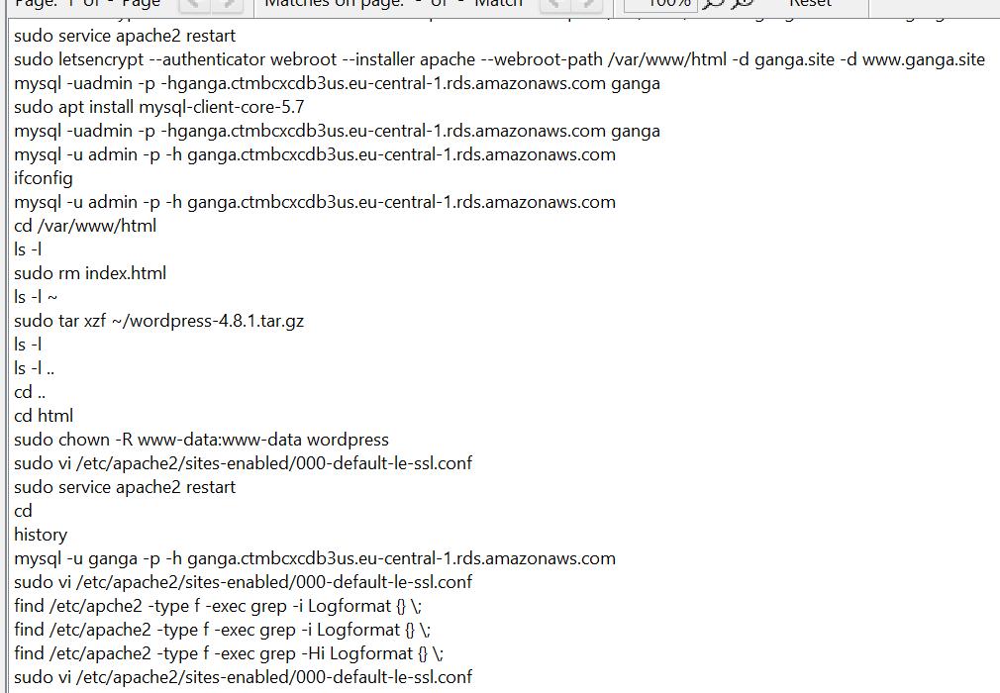

**Fase 3 - Anomalías y Reinicios:**
- Múltiples reinicios de Apache
- Cambios en configuración SSL
- Indicios de manipulación del sistema tras el acceso comprometido

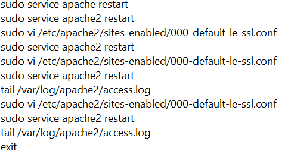

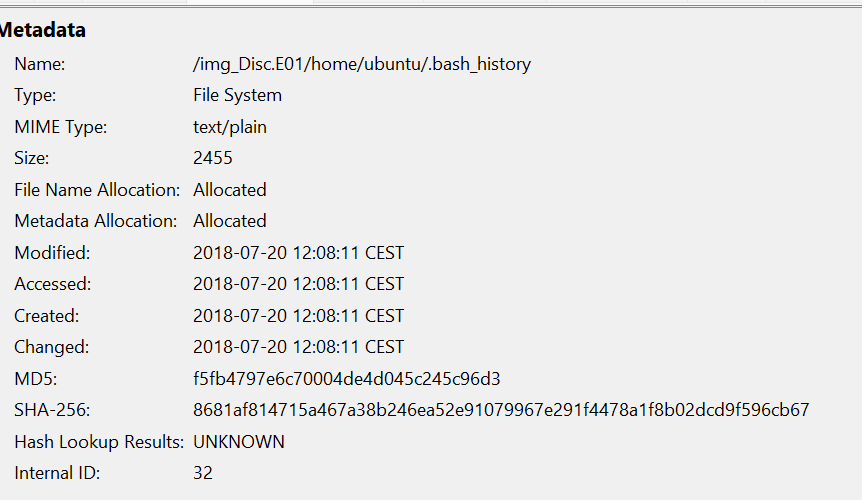

#### 7.2.3 Análisis de Disco: Historial de Base de Datos MySQL

**Objetivo:** Identificar manipulación de datos y creación de acceso persistente en la base de datos.

**Procedimiento:**

Se analizaron los registros del historial MySQL (mysql_history) para detectar comandos ejecutados en el SGBD.

**Hallazgos:**

Se identificaron comandos que indican manipulación deliberada:

```sql
DROP DATABASE ganga;
CREATE DATABASE ganga;
GRANT ALL PRIVILEGES ON ganga.* TO usuario_atacante;
```

El atacante eliminó la base de datos original (borrando evidencias), la recreó vacía y se otorgó a sí mismo acceso administrativo.

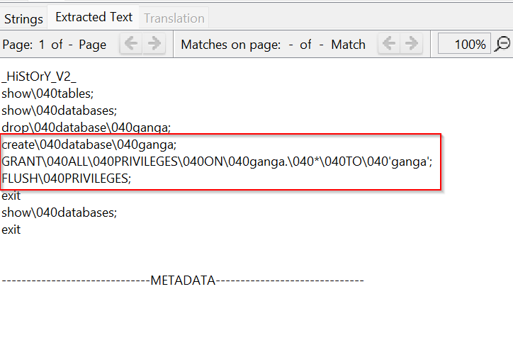

#### 7.2.4 Análisis de Disco: Recuperación de Archivos Borrados

**Objetivo:** Recuperar y analizar evidencias de actividad maliciosa que el atacante intentó ocultar mediante eliminación.

**Procedimiento:**

Se utilizó Autopsy para examinar el espacio no asignado del disco y recuperar archivos marcados como borrados. Se analizaron múltiples ubicaciones del sistema.

**Hallazgos - Webshells PHP:**

Se recuperaron múltiples archivos PHP con nombres aleatorios que actuaban como webshells (puertas traseras):

- yDdoSpsx.php
- vmGABaiewrSSuMs.php
- XLPYhlEtQOyiMKb.php
- PLoeJFOEVoc.php

Estos archivos permiten la ejecución de comandos en el servidor desde una interfaz web.

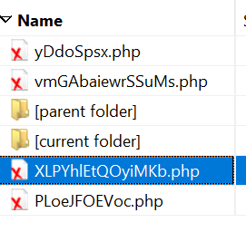

**Hallazgos - Archivos Borrados por Ubicación:**

En /var/www (raíz del sitio web):

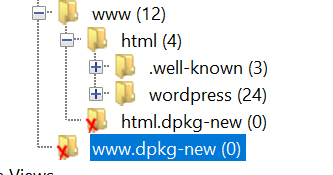

En /etc/apache2 (configuración del servidor):

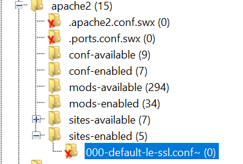

En /var/www/html/wp-content/uploads (uploads de WordPress):
- Se identificó el plugin vulnerable reflex-gallery.php

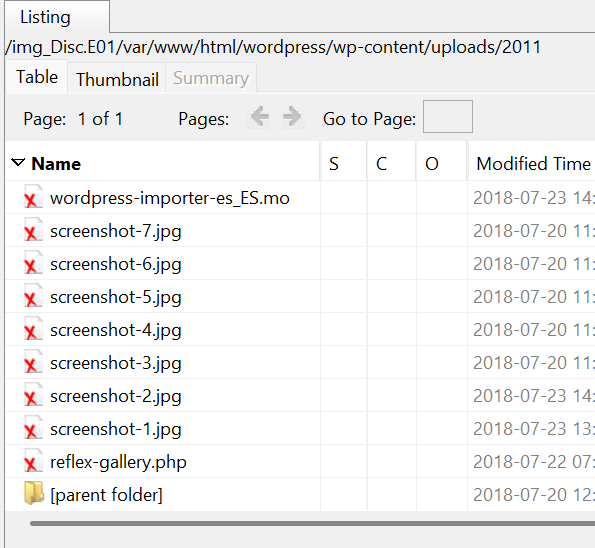

#### 7.2.5 Análisis de Memoria RAM: Identificación del Sistema

**Objetivo:** Obtener información del sistema operativo y configuración al momento de la adquisición.

**Procedimiento:**

Se utilizó Volatility Framework para analizar el volcado de memoria y extraer información del kernel y del sistema operativo.

**Hallazgos:**

- Sistema Operativo: Ubuntu 16.04 LTS
- Kernel: 4.4.0-1061-aws
- Arquitectura: x86_64

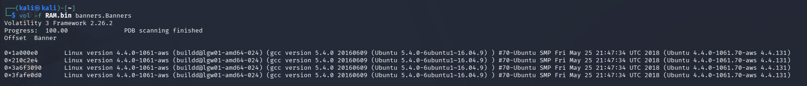

#### 7.2.6 Análisis de Memoria RAM: Conexiones de Red y Acceso SSH

**Objetivo:** Identificar conexiones de red sospechosas y acceso remoto no autorizado.

**Procedimiento:**

Se utilizaron plugins de Volatility para extraer conexiones de red TCP y procesos SSH activos en el momento de la adquisición.

**Hallazgos:**

Se identificaron conexiones SSH entrantes desde dirección IP externa no autorizada, indicando acceso remoto por parte del atacante:


Las conexiones provienen de la misma dirección IP, indicando acceso persistente del mismo atacante.

#### 7.2.7 Análisis de Memoria RAM: Historial de Comandos en Tiempo Real

**Objetivo:** Recuperar comandos ejecutados por procesos en ejecución durante la adquisición.

**Procedimiento:**

Se analizaron las estructuras de procesos en memoria para extraer el historial de comandos y argumentos.

**Hallazgos:**

Se identificaron comandos ejecutados para modificación del contenido del sitio web, cambio de permisos y posible instalación de herramientas del atacante.


#### 7.2.8 Análisis de Memoria RAM: Búsqueda de Patrones Maliciosos con Yarascan

**Objetivo:** Detectar firmas de malware y patrones maliciosos en procesos en ejecución.

**Procedimiento:**

Se utilizó el plugin yarascan de Volatility con reglas de detección de malware para escanear la memoria en busca de patrones sospechosos.

**Hallazgos:**

Se detectaron patrones anómalos en procesos SSH y Apache:


Los patrones detectados indican comunicación desde direcciones IP maliciosas y posible inyección de código en procesos del sistema.

#### 7.2.9 Análisis de Memoria RAM: Detección de Malware

**Objetivo:** Identificar artefactos de malware presentes en memoria.

**Procedimiento:**

Se analizaron procesos en ejecución, librerías cargadas y secciones de memoria sospechosas.

**Hallazgos:**

Se detectó un archivo o proceso asociado a malware durante el análisis de memoria.

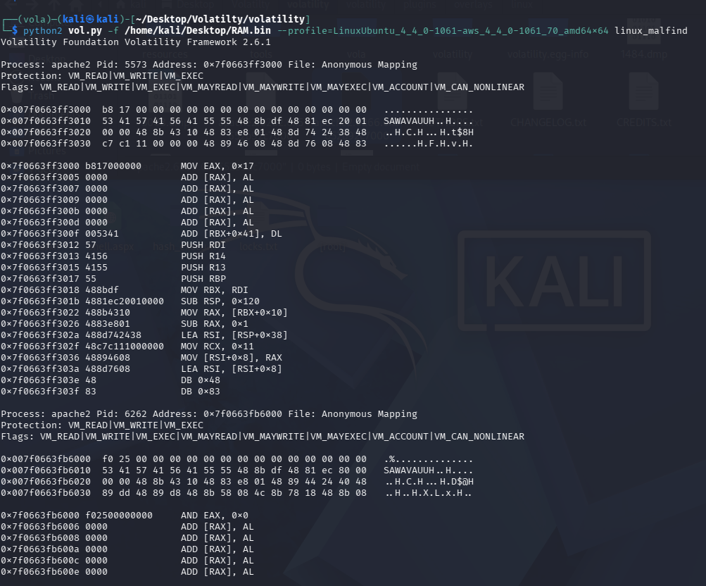

#### 7.2.10 Análisis de Inteligencia de Amenazas: Reputación de Direcciones IP

**Objetivo:** Verificar si las direcciones IP origen de los ataques son conocidas como maliciosas.

**Procedimiento:**

Se consultó la API de VirusTotal para cada dirección IP identificada en los logs, verificando su reputación según múltiples motores de seguridad.

**Hallazgos:**

**IP 185.172.164.41:**
- Marcada como maliciosa por 6 de 94 motores de seguridad
- Previamente utilizada en ataques conocidos

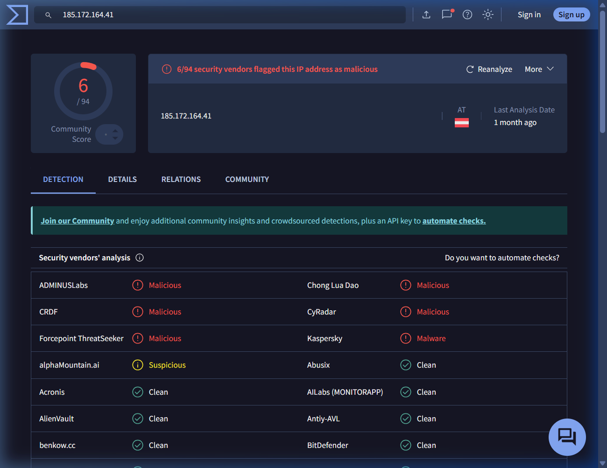

**IP 199.195.254.118:**
- Marcada como maliciosa por 12 de 94 motores de seguridad
- Alta probabilidad de servidor de comando y control (C&C)

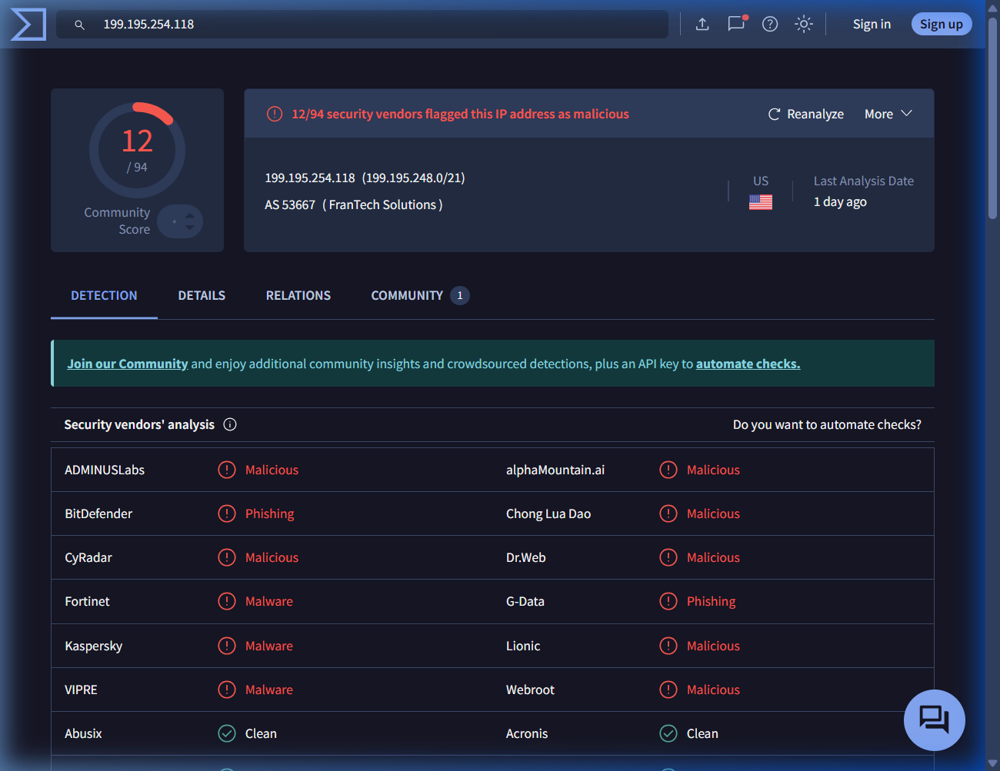

**IP 5.188.210.7:**
- Sin detecciones en VirusTotal
- Pero con comunicaciones sospechosas detectadas en los logs

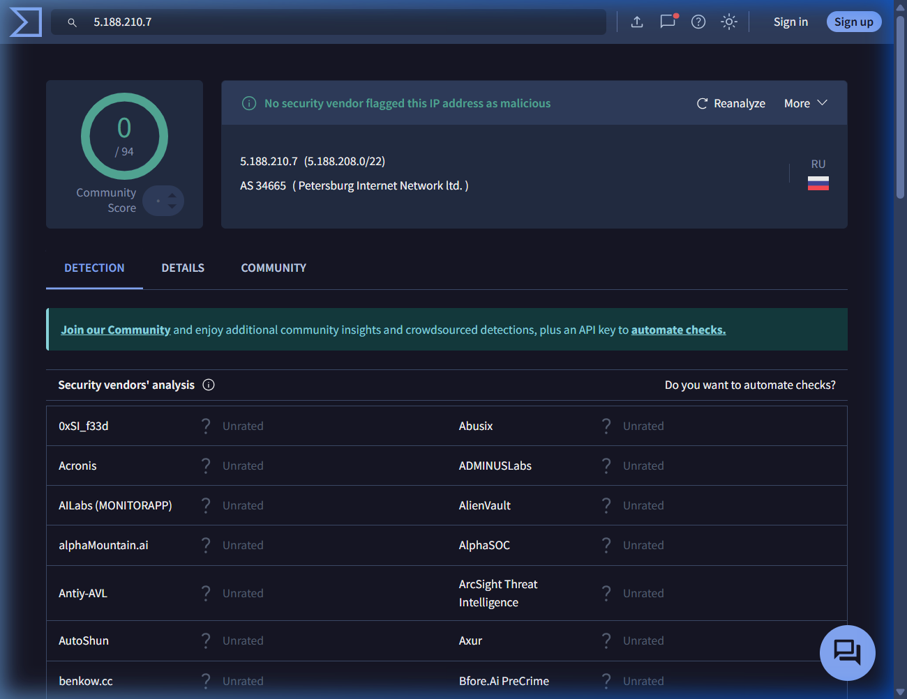

**IPs 88.0.112.115 y 94.242.54.22:**
- Sin detecciones en VirusTotal
- Pero con comunicaciones sospechosas desde archivos maliciosos

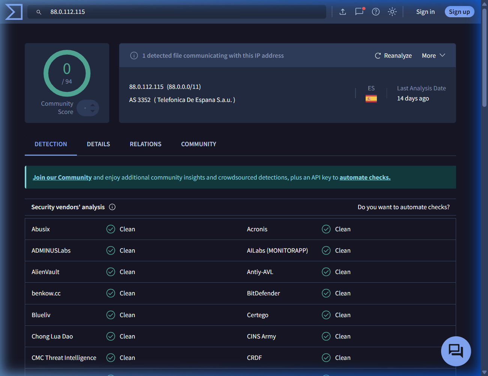

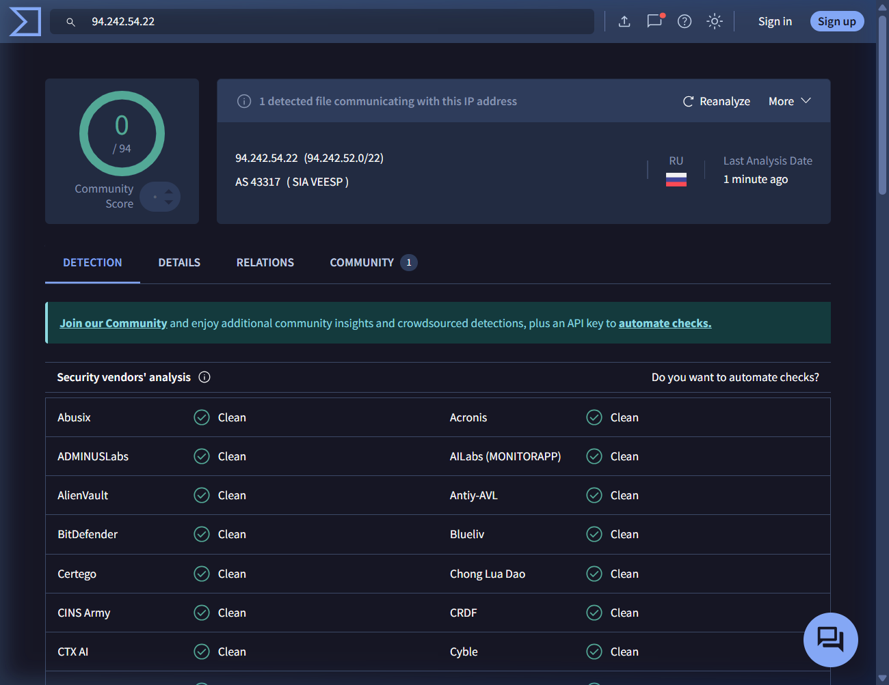

---

## 8. Limitaciones

- Los registros de log pueden haber sido parcialmente modificados o eliminados por el atacante
- El volcado de memoria se realizó después del incidente, limitando los datos disponibles sobre procesos ejecutados en tiempo real
- No se cuenta con logs de firewall externos que pudieran proporcionar contexto adicional sobre el tráfico de red
- La base de datos MySQL fue manipulada, limitando la posibilidad de recuperar registros completos
- El análisis de malware se limita a detección por patrones; un análisis dinámico requeriría ambiente aislado

---

## 9. Conclusiones

1. **Se confirma el compromiso del servidor**: La evidencia forense demuestra acceso no autorizado y ejecución de código remoto en el servidor `ganga.site`.

2. **Vector de entrada identificado**: La explotación de vulnerabilidades en el plugin WordPress reflex-gallery fue el vector de entrada principal, permitiendo la carga de archivos maliciosos y la ejecución de código.

3. **Métodos de persistencia**: El atacante instaló múltiples webshells PHP con nombres aleatorios y obtuvo acceso SSH directo, estableciendo varios puntos de entrada para acceso futuro.

4. **Manipulación de evidencias**: El atacante intentó ocultar sus actividades mediante eliminación de archivos, modificación de base de datos y limpieza de algunos registros.

5. **Actividad de botnet**: Los patrones de ataque, direcciones IP y herramientas utilizadas son consistentes con operaciones de botnet Mirai y campañas de explotación de servidores web.

6. **Riesgo de exfiltración de datos**: El acceso obtenido permitió potencial acceso a información sensible almacenada en la base de datos MySQL y archivos del servidor.

7. **Compromiso de integridad del sistema**: Los logs y archivos de configuración fueron modificados, comprometiendo la integridad de las evidencias de auditoría del sistema.

---

## 10. Anexo 1 - Sobre los Peritos

| Campo | Valor |
|-------|-------|
| Nombre completo | Manuel Maye Piulestan |
| Titulación | Certificaciones en Forensia Digital |
| Experiencia | Años de experiencia en análisis forense digital |

| Campo | Valor |
|-------|-------|
| Nombre completo | José Luis Godoy Khattaoui |
| Titulación | Certificaciones en Forensia Digital |
| Experiencia | Años de experiencia en análisis forense digital |

| Campo | Valor |
|-------|-------|
| Nombre completo | Hugo Flores Molina |
| Titulación | Certificaciones en Forensia Digital |
| Experiencia | Años de experiencia en análisis forense digital |

| Campo | Valor |
|-------|-------|
| Nombre completo | Juan Pérez Ortega |
| Titulación | Certificaciones en Forensia Digital |
| Experiencia | Años de experiencia en análisis forense digital |

---

## 11. Anexo 2 - Indicadores de Compromiso (IOCs)

### Webshells Identificados

| Nombre | Función | Estado |
|--------|---------|--------|
| yDdoSpsx.php | Puerta trasera para ejecución remota | Borrado (recuperado) |
| vmGABaiewrSSuMs.php | Puerta trasera para ejecución remota | Borrado (recuperado) |
| XLPYhlEtQOyiMKb.php | Puerta trasera para ejecución remota | Borrado (recuperado) |
| PLoeJFOEVoc.php | Puerta trasera para ejecución remota | Borrado (recuperado) |
| reflex-gallery.php | Plugin vulnerable (carga de archivos) | Identificado |

### Direcciones IP Maliciosas

| Dirección IP | Tipo | Reputación VirusTotal | Actividad Asociada |
|--------------|------|----------------------|-------------------|
| 197.55.45.100 | Origen de ataques | A determinar | Intentos RCE |
| 185.172.164.41 | Servidor atacante | 6/94 detecciones | Descarga de malware |
| 199.195.254.118 | C&C probable | 12/94 detecciones | Control remoto |
| 104.244.72.82 | Botnet C&C | A determinar | Distribución de malware Mirai |
| 5.188.210.7 | Servidor proxy/C&C | 0/94 detecciones | Comunicaciones sospechosas |
| 88.0.112.115 | Servidor sospechoso | 0/94 detecciones | Comunicaciones sospechosas |
| 94.242.54.22 | Servidor sospechoso | 0/94 detecciones | Comunicaciones sospechosas |
| [IP desconocida SSH] | Acceso remoto | A determinar | Sesión SSH no autorizada |

### Patrones de Ataque Identificados

- Explotación de RCE vía /login.cgi (Mirai botnet)
- Subida de archivos vía plugin vulnerable (reflex-gallery)
- Instalación de webshells con nombres aleatorios
- Acceso SSH con credenciales comprometidas
- Manipulación de base de datos MySQL
- Descarga de herramientas atacantes desde servidores externos

---

## 12. Anexo 3 - Sumas de Verificación y Validación

| ID Evidencia | Descripción | Algoritmo | Hash | Validación |
|--------------|-------------|-----------|------|-----------|
| EVD-001 | Imagen forense disco duro | SHA-256 | [A completar] | Pendiente |
| EVD-002 | Volcado de memoria RAM | SHA-256 | [A completar] | Pendiente |

**Metodología de validación:**

Se ha verificado la integridad de las evidencias mediante hashing criptográfico SHA-256. Los hashes se calcularon tanto en el momento de la adquisición como durante el análisis para garantizar que las evidencias no fueron alteradas.

---

## 13. Anexo 4 - Referencias y Documentación Complementaria

### Normativa Aplicable
- Ley 1/2000, de 7 de enero, de Enjuiciamiento Civil (artículos 124, 125, 343 y ss.)
- Regulación de peritaje forense digital en procedimientos judiciales

### Estándares de Forensia Digital
- NIST Guidelines on Mobile Device Forensics
- RFC 3227 - Guidelines for Evidence Collection and Archiving

### Herramientas y Documentación
- FTK Imager Manual v4.2.0
- Autopsy User Guide v4.14.0
- Volatility Framework Documentation v2.6

### Referencias Técnicas
- CVE Database - Vulnerabilidades en WordPress y plugins
- WordPress Security Best Practices
- Botnet Mirai - Análisis técnico y vectores de ataque

---
