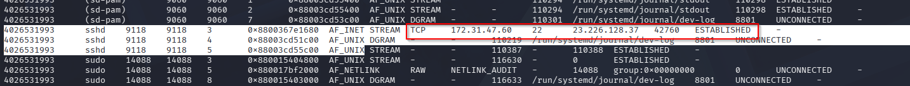
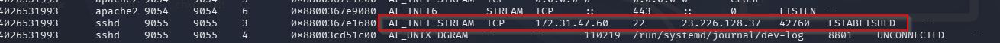
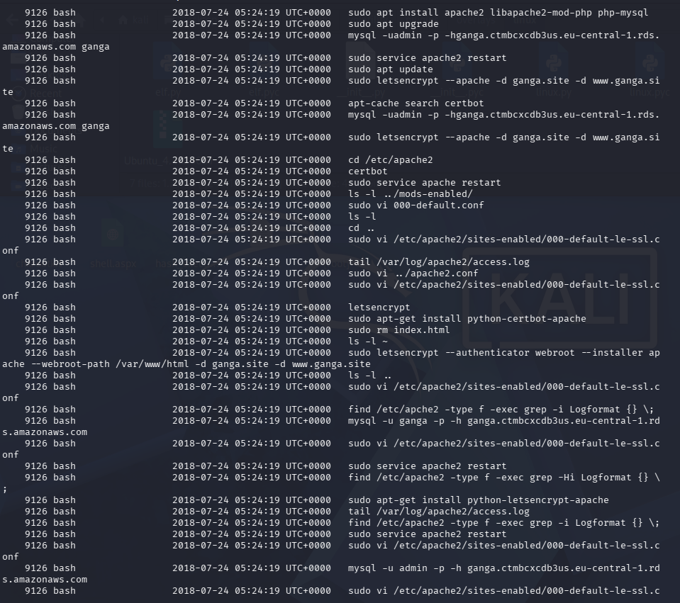
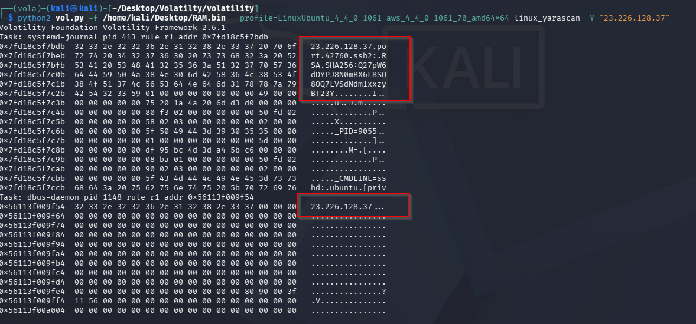
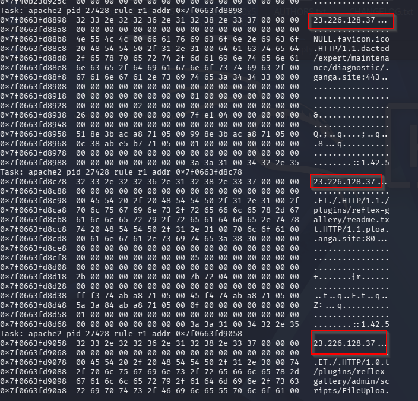

# Informe de Análisis de Memoria RAM

---

## 1. Análisis Inicial de la Memoria

Al analizar la memoria con Volatility, notamos que **no existe un perfil predefinido** para la máquina. Sin embargo, ejecutando:

```bash
volatility -f RAM.bin banners.Banners
```

Obtenemos el siguiente resultado:


El resultado indica:
- **Kernel:** 4.4.0-1061-aws
- **Sistema Operativo:** Ubuntu 16.04

---

## 2. Descarga y Extracción de Símbolos del Kernel

Para continuar, necesitamos los símbolos del kernel. Realiza los siguientes pasos:

1. Ve a la página de [Kernel Ubuntu AWS](https://security.ubuntu.com/ubuntu/pool/main/l/linux-aws/)
2. Descarga el archivo:
	- `linux-image-4.4.0-1061-aws_4.4.0-1061.64_amd64.deb`
3. Extrae el contenido:
	```bash
	dpkg -x linux-image-4.4.0-1061-aws_4.4.0-1061.64_amd64.deb .
	```
4. Obtén el archivo `vmlinux-4.4.0-1061-aws` (contiene los símbolos del kernel).

---

## 3. Generación de Símbolos con dwarf2json

Para convertir el archivo `vmlinux` a un formato compatible con Volatility:

1. Clona y compila `dwarf2json`:
	```bash
	git clone https://github.com/volatilityfoundation/dwarf2json
	cd dwarf2json
	go build
	```
2. Genera el archivo de símbolos:
	```bash
	./dwarf2json linux --elf vmlinux-4.4.0-1061-aws > symbols.json
	```

	

3. Organiza los símbolos:
	```bash
	mkdir symbols
	mv symbols.json symbols/
	```

---

## 4. Análisis de Procesos con Volatility

Con los símbolos generados, ejecuta:

```bash
vol -f RAM.bin --symbol-dirs=./symbols linux.pslist.PsList
```


---

## 5. Hallazgos Relevantes en la Memoria RAM

A continuación se presentan las principales evidencias encontradas durante el análisis de la memoria RAM, acompañadas de sus respectivas capturas y una breve descripción profesional de cada hallazgo:

### 5.1 Conexiones SSH desde IP desconocida




Ambas capturas muestran conexiones SSH entrantes desde una dirección IP no reconocida, lo que sugiere un posible acceso no autorizado al sistema. Es fundamental investigar la procedencia de esta IP y determinar si corresponde a una actividad legítima o maliciosa.

### 5.2 Historial de comandos sospechoso



En esta evidencia se observa el historial de comandos ejecutados en la máquina. Se infiere que se realizaron modificaciones en el sitio web alojado, lo que podría indicar un intento de alteración o compromiso de la integridad del servicio.

### 5.3 Uso de Yarascan en Apache y SSH




Las siguientes capturas evidencian conexiones desde la misma IP utilizando la herramienta Yarascan sobre los procesos de Apache y SSH. Esto puede indicar una búsqueda activa de patrones maliciosos o la presencia de un atacante analizando servicios críticos del sistema.

### 5.4 Detección de posible malware


La última captura corresponde a la detección de un archivo o proceso sospechoso, potencialmente asociado a malware presente en el equipo. Se recomienda realizar un análisis exhaustivo de este elemento para confirmar su naturaleza y tomar las medidas de remediación necesarias.

---


