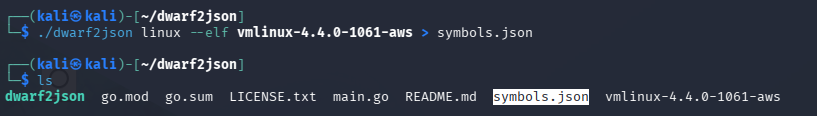

# Informe de Análisis de Memoria RAM

---

## 1. Análisis Inicial de la Memoria

Al analizar la memoria con Volatility, notamos que **no existe un perfil predefinido** para la máquina. Sin embargo, ejecutando:

```bash
volatility -f RAM.bin banners.Banners
```

Obtenemos el siguiente resultado:


El resultado indica:
- **Kernel:** 4.4.0-1061-aws
- **Sistema Operativo:** Ubuntu 16.04

---

## 2. Descarga y Extracción de Símbolos del Kernel

Para continuar, necesitamos los símbolos del kernel. Realiza los siguientes pasos:

1. Ve a la página de [Kernel Ubuntu AWS](https://security.ubuntu.com/ubuntu/pool/main/l/linux-aws/)
2. Descarga el archivo:
	- `linux-image-4.4.0-1061-aws_4.4.0-1061.64_amd64.deb`
3. Extrae el contenido:
	```bash
	dpkg -x linux-image-4.4.0-1061-aws_4.4.0-1061.64_amd64.deb .
	```
4. Obtén el archivo `vmlinux-4.4.0-1061-aws` (contiene los símbolos del kernel).

---

## 3. Generación de Símbolos con dwarf2json

Para convertir el archivo `vmlinux` a un formato compatible con Volatility:

1. Clona y compila `dwarf2json`:
	```bash
	git clone https://github.com/volatilityfoundation/dwarf2json
	cd dwarf2json
	go build
	```
2. Genera el archivo de símbolos:
	```bash
	./dwarf2json linux --elf vmlinux-4.4.0-1061-aws > symbols.json
	```

	

3. Organiza los símbolos:
	```bash
	mkdir symbols
	mv symbols.json symbols/
	```

---

## 4. Análisis de Procesos con Volatility

Con los símbolos generados, ejecuta:

```bash
vol -f RAM.bin --symbol-dirs=./symbols linux.pslist.PsList
```

Esto mostrará la lista de procesos activos en la memoria analizada (PID, PPID, nombre, etc.).

---


